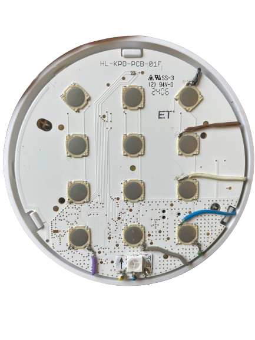
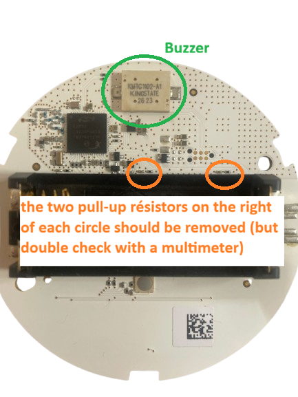

# Repurposing a Qiara Keypad for Home Assistant

Qiara went bankrupt, leaving their smart home devices without cloud support. This tutorial shows how to **hack a Qiara keypad** and turn it into a fully functional Home Assistant alarm keypad using an Arduino Nano ESP32.


## What you'll need

### Hardware

* Qiara keypad (HL-KPD-PCB-01F)
* Arduino Nano ESP32
* 1x addressable LED (NeoPixel / WS2812B)
* Wires (flexible, thin gauge)
* Soldering iron + solder
* Multimeter

### The keypad already has a built-in buzzer!

The Qiara PCB includes a **Kingstate KMTG1102-A1 piezo transducer** on the back. We'll reuse it directly — no need to buy a buzzer.


## Understanding the keypad PCB

### Front (buttons side)

 


The Qiara keypad is a standard **4×3 matrix keypad** with dome buttons:

```
[1] [2] [3]   ← Row 1
[4] [5] [6]   ← Row 2
[7] [8] [9]   ← Row 3
[*] [0] [#]   ← Row 4
 C1  C2  C3   (Columns)
```

Each button has 4 pins:

* **Top-left / bottom-left** → connected together = **ROW side**
* **Top-right / bottom-right** → connected together = **COLUMN side**

### Back (components side)



The back of the PCB contains:

* The main MCU (now unused)
* The Kingstate piezo buzzer
* Pull-down resistors on the column lines ← **these must be removed!**


### ⚠️ Important: pull-down resistors

The original Qiara MCU expected pull-down resistors on the column lines. Even with the MCU removed, these resistors remain on the PCB and will pull your ESP32 column pins to GND, preventing any key detection.

**You must locate and desolder the pull-down resistors on the back of the PCB.**

How to find them:

1. Power up your ESP32 with the keypad connected
2. Measure voltage on each column pin — pull-down resistors are present for C2 and C3 and have to be removed
3. Disconnect the ESP32, then use multimeter in continuity mode: probe each SMD component on the back while touching a column pin
4. When you hear a beep → that's your pull-down resistor, desolder it
5. Repeat for all 3 columns and verify each column rises back to 3.3V


## Wiring

### Remove the battery holder

The original battery holder must be removed to prevent the old MCU from interfering with your ESP32.

### Wiring diagram

!\[Wiring diagram\](photos/wiring_diagram.png)

### Connection table

| Keypad point | Description | Arduino Nano ESP32 pin |
|----|----|----|
| Row 1 | Button 3, top-left pad | D2 |
| Row 2 | Button 6, top-left pad | D3 |
| Row 3 | Button 9, top-left pad | D4 |
| Row 4 | Button #, top-left pad | D5 |
| Col 1 | Button \*, bottom-right pad | D10 |
| Col 2 | Button 0, bottom-right pad | D11 |
| Col 3 | Button #, bottom-right pad | D12 |
| Buzzer + | Piezo positive pad | D7 |
| Buzzer − | Piezo negative pad | GND |
| NeoPixel Data | LED signal | A0 |
| NeoPixel VCC | LED power | 3V3 |
| NeoPixel GND | LED ground | GND |

### Soldering tips

* Pass the wire **through the ESP32 hole**, bend slightly, solder on the back — much more reliable than surface soldering
* Keep iron contact **brief (1-2 seconds)** on dome button pads to avoid damage
* Tin both the wire and the pad separately before joining them

### Buzzer polarity

Use your multimeter in **diode mode** to identify the + pin (\~0.7V = forward bias = + on red probe). Since the buzzer is a **passive piezo transducer**, it requires a PWM signal — use `tone(pin, 4100)` at its resonant frequency of \~4100 Hz.


## Arduino code

See `code/alarm_keypad.ino`

### Required libraries

* `Keypad` by Mark Stanley
* `Adafruit NeoPixel`
* `PubSubClient` by Nick O'Leary
* `ArduinoJson` by Benoit Blanchon
* `WiFi` (built-in ESP32)

### Key behaviours

| Action | Result |
|----|----|
| Press `*` | Send arm request to HA |
| Press `#` during arming countdown | Cancel arming |
| Type code + `#` | Send disarm request to HA |
| Correct code | Green LED + confirmation beep |
| Wrong code | Blue LED flash + 4 short beeps |
| Hardware error (siren unplugged) | Orange LED + 4×4 beep pattern |
| Arming countdown | Red LED blink + alternating beep |
| Armed | Red LED solid |
| Disarmed | Green LED solid |


## Home Assistant setup

### MQTT topics

| Topic | Direction | Description |
|----|----|----|
| `home/alarm/request` | ESP32 → HA | arm / disarm requests |
| `home/alarm/response` | HA → ESP32 | ok / fail response |
| `home/alarm/state` | HA → ESP32 | armed / disarmed / hw_error |

### input_select for alarm codes

```yaml
input_select:
  alarm_codes:
    name: Alarm codes
    options:
      - "1234"
      - "5678"
```

### Automations

See `home-assistant/automations.yaml`

#### Validate disarm code

```yaml
trigger:
  - platform: mqtt
    topic: home/alarm/request
condition:
  - condition: template
    value_template: "{{ trigger.payload_json.action == 'disarm' }}"
action:
  - choose:
      - conditions:
          - condition: template
            value_template: >
              {{ trigger.payload_json.code in 
              state_attr('input_select.alarm_codes', 'options') }}
        sequence:
          - action: mqtt.publish
            data:
              topic: home/alarm/response
              payload: '{"result":"ok"}'
    default:
      - action: mqtt.publish
        data:
          topic: home/alarm/response
          payload: '{"result":"fail"}'
```

#### Check hardware before arming

```yaml
trigger:
  - platform: mqtt
    topic: home/alarm/request
    payload: '{"action":"arm"}'
action:
  - choose:
      - conditions:
          - type: is_power
            condition: device
            entity_id: sensor.siren_plug_power
            below: 1
        sequence:
          - action: mqtt.publish
            data:
              topic: home/alarm/state
              payload: '{"state":"hw_error"}'
    default:
      - action: mqtt.publish
        data:
          topic: home/alarm/state
          payload: '{"state":"armed"}'
```


## Tips & troubleshooting

**Keypad not detected / all buttons read as column 1**
→ Pull-down resistors still present on columns — find and desolder them (see above)

**Columns stuck at 0V with ESP32 powered**
→ Same cause — pull-down resistors on PCB back

**Buzzer makes no sound**
→ It's a passive piezo, use `tone(pin, 4100)` not `digitalWrite(pin, HIGH)`

**Keys not detected during arming countdown**
→ Make sure cancellation logic is NOT inside a blocking `delay()` loop — use `millis()` instead


## License

MIT — feel free to reuse, adapt, and share!

## Disclamer

A LLM was used to assist the generation of this tutorial